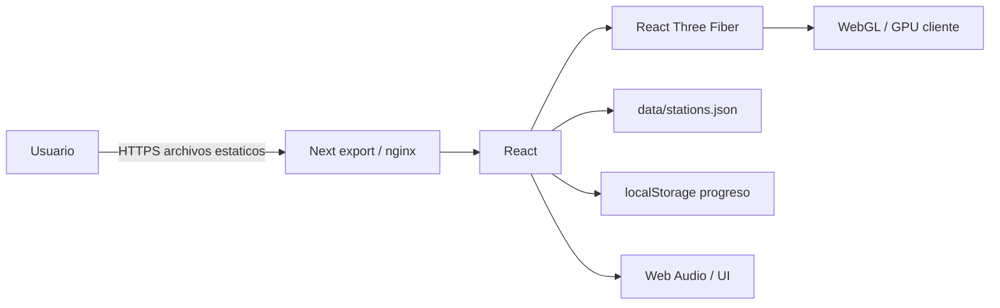
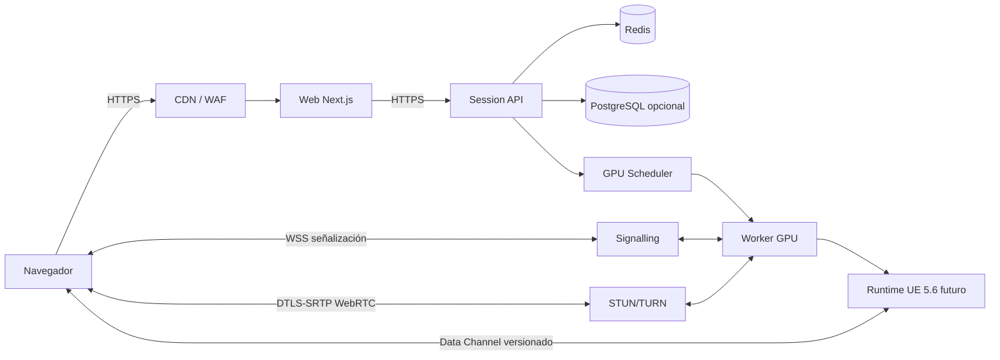
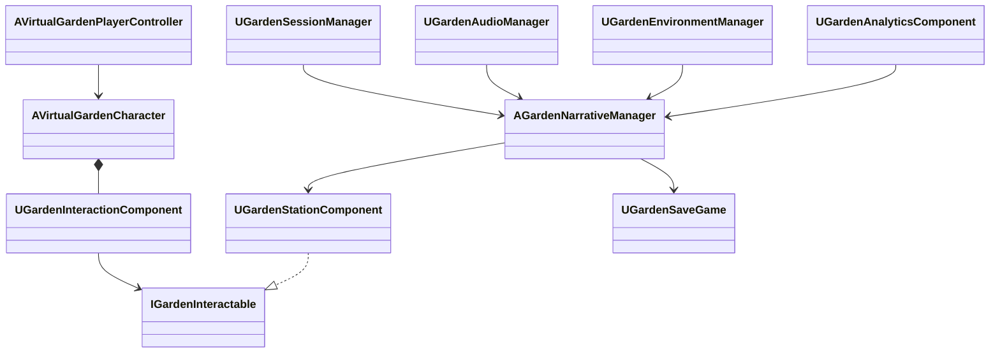
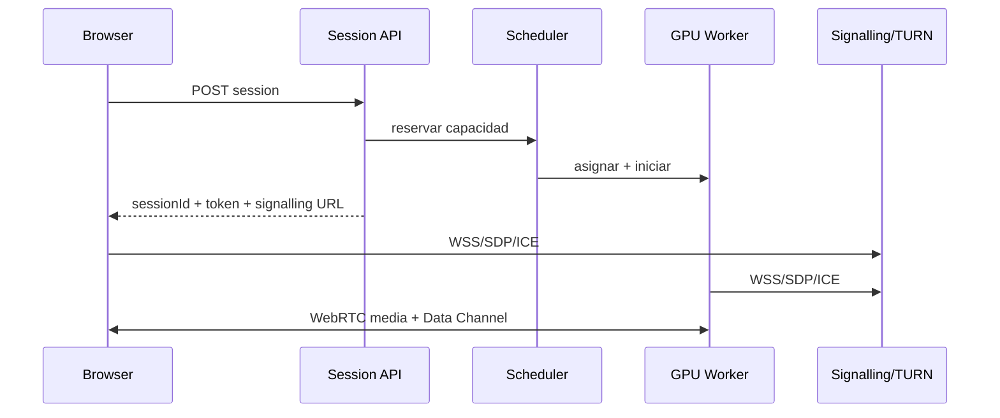
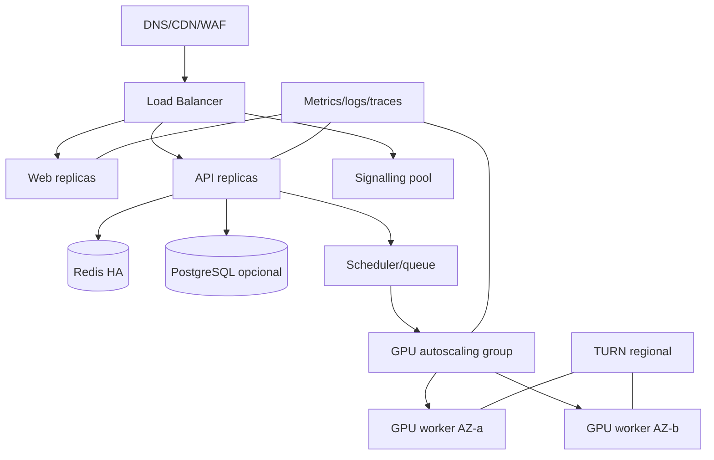
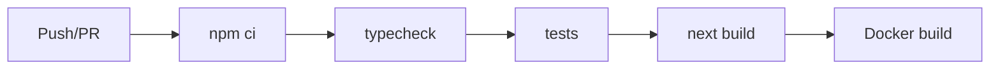

# Arquitectura y entregables A–R

## Decisión de alcance

Hay dos arquitecturas distintas:

1. **Actual, ejecutable:** Next.js + React + React Three Fiber/Three.js; render WebGL en el dispositivo del visitante.
2. **Objetivo futuro:** Unreal Engine 5.6 renderizando en workers NVIDIA y entregando audio/video e input mediante Pixel Streaming/WebRTC.

No existe runtime UE en este repositorio. Los módulos, clases y Blueprints siguientes son contratos de diseño para una implementación futura. No representan tipos ya compilados ni sustituyen la documentación oficial de UE 5.6.

## A. Diagramas de arquitectura

### Actual



### Objetivo futuro



## B. Matriz tecnológica

| Área | Actual | Objetivo futuro | Criterio |
|---|---|---|---|
| Web | Next.js 16, React 19, TypeScript | Wrapper oficial/compatible de Pixel Streaming | UI, accesibilidad y sesión |
| 3D | Three.js + React Three Fiber, WebGL | UE 5.6, Nanite, Lumen, Niagara | Migrar cuando calidad/coste lo justifique |
| Audio | Audio del navegador/stream actual | Unreal Audio Engine, MetaSounds; HRTF evaluado | Una mezcla estéreo viaja por WebRTC |
| Sesiones | JSON local + localStorage | API Node TS + Redis; PostgreSQL opcional | El slice actual no consume servicios |
| Transporte | HTTPS web | WSS + WebRTC + Data Channel | DTLS-SRTP, TURN/TLS |
| Infra | Docker para Next | CDN/WAF, LB, signalling, TURN, GPU pool | IaC/Kubernetes opcional |
| Observabilidad | Logs Next/CI | OpenTelemetry, Prometheus, Grafana, Sentry | SLO de conexión y latencia |

## C. Estructura de repositorio

Estructura real relevante:

```text
/
├── app/ components/ hooks/ lib/ data/ tests/   # sitio estático WebGL
├── docs/
├── Dockerfile
├── docker-compose.yml
└── .github/workflows/ci.yml
```

Estructura objetivo, todavía no creada:

```text
/unreal/{Config,Content,Plugins,Source}
/backend/src/{modules,routes,services,workers}
/pixel-streaming/{signalling,config}
/infrastructure/{terraform,kubernetes,monitoring}
/scripts
```

La separación evita mezclar assets binarios UE, servicios y web. Assets UE grandes usarían Git LFS con reglas revisadas antes de subirlos.

## D. Módulos Unreal futuros

| Módulo | Responsabilidad | Dependencias permitidas |
|---|---|---|
| GardenCore | estados, tags, contratos y configuración | Core, Engine |
| GardenGameplay | personaje, interacción y estaciones | GardenCore, Enhanced Input |
| GardenNarrative | progreso y Data Assets narrativos | GardenCore |
| GardenAudio | estados musicales, emisores y zonas | GardenCore, AudioMixer/MetaSounds si UE 5.6 lo confirma |
| GardenEnvironment | viento, iluminación, foliage y calidad | GardenCore, Niagara |
| GardenStreamingBridge | adaptador de mensajería navegador–runtime | GardenCore + plugin Pixel Streaming validado |
| GardenTelemetry | eventos anónimos y métricas | GardenCore |

`GardenStreamingBridge` aísla la integración version-dependiente. Los nombres de módulos/plugin y sus dependencias exactas deben confirmarse en UE 5.6.

## E. Diagrama conceptual de clases C++



Responsabilidades propuestas:

- `AVirtualGardenPlayerController`: Enhanced Input y adaptación mouse/touch/gamepad.
- `AVirtualGardenCharacter`: locomoción y cámara, sin lógica narrativa.
- `UGardenInteractionComponent`: consulta/selección y ejecución de `IGardenInteractable`.
- `UGardenStationComponent`: proximidad, estado y configuración por estación.
- `AGardenNarrativeManager`: máquina de estados y orden/progreso.
- `UGardenAudioManager`: mezcla y transiciones.
- `UGardenEnvironmentManager`: viento, luz y perfiles visuales.
- `UGardenSessionManager`: ciclo de sesión y bridge externo.
- `UGardenAnalyticsComponent`: eventos sin PII.
- `UGardenSaveGame`: snapshot local/efímero si el producto lo requiere.
- Interfaces: `IGardenInteractable`, `IGardenNarrativeActor`, `IGardenAudioReactive`.

Son nombres propios propuestos, no APIs nativas de Unreal.

## F. Mapa de responsabilidades Blueprint

| Blueprint futuro | Hace | No hace |
|---|---|---|
| `BP_StationBase` | composición visual, VFX, Sequencer y parámetros | autoridad del progreso |
| `BP_Station_*` | variación específica por estación | protocolo de red |
| `BP_GardenGameMode` | ensamble/configuración de experiencia | reglas complejas duplicadas |
| `BP_WindDirector` | expone presets al arte | múltiples relojes de viento |
| `WBP_NarrativeOverlay` | presentación UMG accesible | almacenar narrativa |
| Level Blueprints | eventos estrictamente locales | lógica reusable/global |

La narrativa vive en Data Assets (`DA_Station_*`) y la lógica crítica en C++; Blueprints llaman contratos expuestos y contienen iteración artística.

## G. Topología Pixel Streaming objetivo

Un visitante obtiene una sesión, el scheduler reserva un worker 1:1 inicialmente y devuelve endpoint/token efímero. Signalling negocia WebRTC; media intenta ruta directa y usa TURN cuando NAT/firewall lo exige. Input y mensajes viajan por Data Channel. Un SFU solo se evalúa para experiencias de uno-a-muchos; no mejora por sí solo el modelo interactivo 1:1.



## H. Infraestructura cloud objetivo



AWS, Azure, GCP, OVHcloud o Equinix son viables si ofrecen NVIDIA, drivers compatibles, puertos UDP, cuotas y región cercana. Seleccionar tras una prueba de codec, coste por sesión, cold start y egress; no por nombre del proveedor.

## I. Modelo JSON de sesión

Estado efímero canónico en Redis; persistencia agregada/anónima opcional en PostgreSQL.

```json
{
  "schemaVersion": 1,
  "sessionId": "ses_opaque_random",
  "status": "CONNECTED",
  "workerId": "gpu-region-a-0042",
  "qualityProfile": "high",
  "createdAt": "2026-09-10T18:00:00Z",
  "expiresAt": "2026-09-10T18:20:00Z",
  "lastSeenAt": "2026-09-10T18:03:12Z",
  "reconnectUntil": "2026-09-10T18:04:12Z",
  "connection": {
    "signallingUrl": "wss://stream.example.invalid/s/opaque",
    "tokenHash": "server-side-only",
    "region": "us-east"
  },
  "experience": {
    "completedStationIds": ["welcome"],
    "activeStationId": "memory",
    "audioEnabled": true,
    "reducedMotion": false
  }
}
```

Estados de sesión: `REQUESTED → ALLOCATING → STARTING → READY → CONNECTED → RECONNECTING → ENDED`, con `FAILED` y `EXPIRED`. Worker: `AVAILABLE, ALLOCATING, STARTING, CONNECTED, BUSY, DRAINING, ERROR, OFFLINE`. IDs opacos y tokens con alta entropía; nunca guardar token en claro.

Mensajería Data Channel propuesta:

```json
{
  "version": 1,
  "id": "msg_opaque",
  "type": "StationActivated",
  "timestamp": "2026-09-10T18:03:12Z",
  "payload": { "stationId": "friendship_bridge" }
}
```

Validar esquema, tamaño, tipo, versión, frecuencia y autorización en ambos extremos; rechazar campos/tipos desconocidos según política compatible.

## J. Compatibilidad de navegador objetivo

| Navegador | WebGL actual | Pixel Streaming futuro | Validación |
|---|---|---|---|
| Chrome, 2 últimas | Objetivo principal | Objetivo principal | desktop/Android real |
| Edge, 2 últimas | Objetivo principal | Objetivo principal | desktop real |
| Firefox, 2 últimas | Soportado | Objetivo con prueba WebRTC/codecs | desktop real |
| Safari, 2 últimas | Soportado con límites | Condicionado a WebRTC, autoplay y codec | macOS/iOS real |

Requiere JavaScript, WebGL2 para la experiencia actual y, en el futuro, WebRTC/Data Channel. Detectar capacidades, no user-agent. Probar teclado, pointer lock, touch, orientación, audio tras gesto, reconexión y redes corporativas. Ofrecer error comprensible y contenido alternativo.

## K. Performance budget

Frame CPU/GPU, memoria, FPS y frame pacing se definen en [PERFORMANCE.md](PERFORMANCE.md). Son hipótesis iniciales que deben medirse en el build definitivo.

## L. Asset budget

Límites de paquete, texturas, geometría, audio, partículas y materiales están en [PERFORMANCE.md](PERFORMANCE.md), junto con reglas de inventario/licencias.

## M. Network bandwidth budget

Bitrate por resolución/FPS, audio, egress, RTT, pérdida y jitter están en [PERFORMANCE.md](PERFORMANCE.md). Dependen de codec, ruta y región.

## N. GPU recommendations

Clases NVIDIA para desarrollo, 1080p y 1440p, VRAM, margen y criterios de benchmark están en [PERFORMANCE.md](PERFORMANCE.md). No constituyen certificación de compatibilidad UE 5.6.

## O. Modelo de seguridad

Confianza cero entre browser, control plane y worker. CDN/WAF termina HTTPS; API autentica tokens efímeros y autoriza sesión/recurso; signalling no acepta sesiones arbitrarias; TURN usa credenciales temporales; redes privadas aíslan Redis/DB/workers; secretos viven en secret manager; telemetría minimiza PII. Amenazas, controles y respuesta están en [SECURITY.md](SECURITY.md).

## P. Pipeline CI/CD

Actual:



`.github/workflows/ci.yml` implementa ese pipeline sin publicar imágenes e incluye lint, tipos, pruebas y build. Futuro: workflow UE separado en runner Windows con UE 5.6 licenciado/cacheado, BuildGraph/AutomationTool **solo tras verificar comandos oficiales 5.6**, pruebas, empaquetado y subida a storage privado; luego image/AMI de worker, escaneo, staging, smoke WebRTC, aprobación y despliegue progresivo con rollback.

## Q. Roadmap

1. **Actual:** estabilizar vertical slice WebGL, accesibilidad, métricas y budgets.
2. **Spike UE 5.6:** proyecto mínimo, build empaquetado Windows/Linux, un nivel y una interacción; validar licencias y APIs.
3. **Spike Pixel Streaming:** frontend oficial 5.6, signalling, STUN/TURN, input y Data Channel en laboratorio.
4. **Paridad vertical:** una estación completa, audio, Niagara, Lumen/Nanite medidos.
5. **Control plane:** sesión, Redis, tokens, worker health y reconexión.
6. **Cloud staging:** GPU regional, observabilidad, pruebas de navegadores/red/carga y seguridad.
7. **Contenido/optimización:** 6–8 estaciones, perfiles, assets y audio.
8. **Producción:** DR, autoscaling, runbooks, SLO, costes y rollout gradual.

Cada fase requiere evidencia; “funciona local” no aprueba producción.

## R. Registro de riesgos

| Riesgo | Prob. | Impacto | Mitigación / señal |
|---|---:|---:|---|
| Confundir WebGL actual con UE | Alta | Alta | etiqueta de estado en README/docs y demos |
| Cambios de Pixel Streaming en 5.6 | Media | Alta | spike y validación oficial; adaptador aislado |
| Coste/capacidad GPU | Alta | Alta | cuotas tempranas, pool mínimo, coste/sesión |
| Cold start largo | Alta | Alta | warm pool, imágenes precocidas, medir p95 |
| UDP bloqueado/NAT | Media | Alta | TURN/TLS regional y pruebas corporativas |
| Safari/autoplay/codec | Media | Media | dispositivos reales y gesto explícito |
| Lumen/foliage exceden frame | Alta | Alta | perfiles, culling/HLOD y budgets duros |
| Assets/licencias | Media | Alta | inventario, procedencia, LFS y revisión legal |
| Saturación de egress | Media | Alta | bitrate adaptativo, capacidad por región |
| Abuso de sesiones/GPU | Alta | Alta | rate limit, colas, tokens efímeros, cuotas |
| PII en logs/analytics | Media | Alta | allowlist, redacción y retención corta |
| Audio espacial no sobrevive mezcla | Media | Media | validar percepción extremo a extremo |
| Backend inexistente hoy | Alta | Media | no exponer variables futuras como funcionales |
| Dependencia de un proveedor | Media | Media | contrato portable y benchmark multi-cloud |

## Validación UE 5.6 obligatoria

Antes de implementar cualquier paso Unreal:

1. Fijar exactamente UE 5.6.x y toolchain soportado.
2. Consultar la documentación oficial y el contenido que acompaña esa instalación para Pixel Streaming, plugins, infraestructura frontend/signalling, flags de lanzamiento, codecs y empaquetado.
3. Confirmar nombres de módulos, clases, opciones y comandos en headers/sample/configuración de **esa versión**.
4. Registrar enlace, versión y fecha en una ADR.
5. Probar en un proyecto mínimo empaquetado; no copiar comandos de otras versiones.

Esta documentación usa conceptos estables (WebRTC, signalling, Data Channel, STUN/TURN), pero deliberadamente no prescribe APIs Unreal no verificadas.
